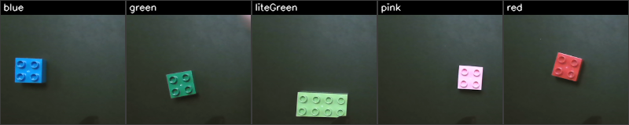
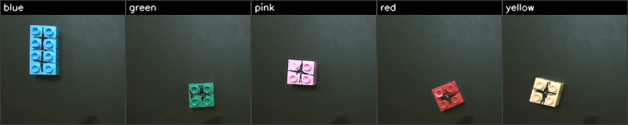

# percept2act

**Perceive → Detect → Reason → Act → Optimize.**

An SO-101 arm inspects a LEGO brick, classifies it defective or good with
Anomalib, and places it in the matching plate — where the link between
perception and manipulation is an **English instruction string**, not a function
call. Inference is OpenVINO-optimized and distributed across the NPU, Arc iGPU
and CPU of an Intel Core Ultra Series 3.

Built for the Intel Physical AI Challenge.

---

## The closed loop

```
PERCEIVE          DETECT               REASON              ACT              OPTIMIZE
wrist camera  ->  Anomalib PatchCore   score -> verdict    SmolVLA places   OpenVINO IR,
at a fixed        on OpenVINO / NPU    -> instruction      the brick in     NPU + GPU + CPU,
inspect pose      median of 12 frames  string              the named plate  per-stage logging
```

The seam between detection and action is a sentence:

| verdict | instruction handed to the policy | plate |
|---|---|---|
| defective | `"put the brick in the coral plate"` | coral |
| good | `"put the brick in the blue plate"` | blue |
| unsure | re-inspect, then fall back to `defective` | — |

Same checkpoint, same scene, different destination — selected purely by text.
Defined in [config/scenario.yaml](config/scenario.yaml) (`task.instructions`),
resolved at [config.py:65](src/percept2act/config.py:65), handed to the policy at
[orchestrator.py:258](src/percept2act/orchestrator.py:258).

---

## How it was built

Two datasets, two models, one loop.

### Stage 1 — the defect detector (Anomalib)

**200 crops captured at the arm's own inspect pose**, 5 distinct brick colours
per class, 20 crops each, all under demo-day lighting
([scripts/18_capture_set.py](scripts/18_capture_set.py) parks the arm and
captures, so the training view is identical to the inference view).

Good bricks — one crop per colour:



Defective — the same colours marked on the stud faces:



PatchCore fits on **normals only**; the defect crops exist purely to place the
threshold. **10 crops of each class are held out of every fit and tuning
decision** — scoring the fitted set measures memorization, not generalization.

| set | n | min | mean | max |
|---|---|---|---|---|
| good, fitted | 90 | 0.0000 | 0.0562 | 0.5659 |
| **good, held out** | 10 | 0.1061 | 0.2363 | 0.4358 |
| defective, tuning | 90 | 0.4468 | 0.7815 | 1.0000 |
| **defective, held out** | 10 | 0.5806 | 0.8010 | 1.0000 |

Threshold `0.5082`, band `±0.048`, placed midway between the two **held-out**
distributions — margin 0.145. Result: **10/10 and 10/10 on held-out data, both
classes.** Fit and export with
[scripts/10_train_detector.py](scripts/10_train_detector.py); re-measure with
[scripts/11_benchmark.py](scripts/11_benchmark.py).

### Stage 2 — the manipulation policy (SmolVLA)

**40 teleop episodes, 9,263 frames**, 20 per instruction, recorded leader→follower
on the SO-101 pair. Both arms are driven back to the same inspect pose between
every episode, and recording will not begin until they match
([scripts/19_record_clean.py](scripts/19_record_clean.py)) — start-pose drift
between episodes is what makes a behaviour-cloned policy fail to grip.

Fine-tuned from `lerobot/smolvla_base` for 16,000 steps on the Arc iGPU
([scripts/14_train_vla.sh](scripts/14_train_vla.sh),
[scripts/16_studio_train.sh](scripts/16_studio_train.sh) for the Studio path).
The dataset is LeRobot v3, which Physical AI Studio loads natively — no import
step.

### Stage 3 — the closed loop

The detector's verdict selects an English instruction, and the policy executes
it. Run it with:

```bash
python scripts/22_demo_wall.py --executor policy
```

Place a brick at the inspect spot. It settles, PatchCore scores it 12 times on
the NPU, the median verdict picks the instruction, and SmolVLA places the brick.
`q` stops. Full command reference in [docs/RUNBOOK.md](docs/RUNBOOK.md).

---

## Requirements → where they are met

The challenge brief lists four deliverables and a mandated stack. This section
maps each to the code that implements it.

### 1. Working closed-loop prototype, perception → action

One process, one command, no manual step between seeing and acting.

| Piece | File |
|---|---|
| The loop itself | [src/percept2act/orchestrator.py](src/percept2act/orchestrator.py) |
| Brick-presence gate (HSV value, colour-agnostic) | [cameras.py `brick_fraction`](src/percept2act/cameras.py) |
| Live demo entry point | [scripts/22_demo_wall.py](scripts/22_demo_wall.py) |
| Minimal demo entry point | [scripts/12_demo.py](scripts/12_demo.py) |

`Orchestrator.run()` sequences `goto_inspect_pose → resolve_verdict → place` per
brick. The arm returns to a fixed pose before every inspection, because the
wrist camera moves with the arm and scores are only comparable from one pose
([orchestrator.py:170](src/percept2act/orchestrator.py:170)).

### 2. VLA + Anomalib integration

| Piece | File |
|---|---|
| Anomalib PatchCore fit + OpenVINO export | [scripts/10_train_detector.py](scripts/10_train_detector.py) |
| Detector inference wrapper | [src/percept2act/detector.py](src/percept2act/detector.py) |
| Verdict → instruction → policy | [orchestrator.py:256](src/percept2act/orchestrator.py:256) |
| SmolVLA inference | [src/percept2act/policy_runner.py](src/percept2act/policy_runner.py) |
| Swappable ACT backends (`stub` / `replay` / `policy`) | [src/percept2act/executor.py](src/percept2act/executor.py) |

The policy runs through LeRobot's own processor pipeline, so tokenization and
normalization match training exactly
([policy_runner.py `_make_processors`](src/percept2act/policy_runner.py)).

### 3. OpenVINO-optimized deployment on Core Ultra 3

| Piece | File |
|---|---|
| `ov.Core()`, device validation, `compile_model` | [detector.py:82–100](src/percept2act/detector.py:82) |
| Static reshape for the NPU plugin | [detector.py `_compile`](src/percept2act/detector.py) |
| Device placement policy | [config/scenario.yaml](config/scenario.yaml) `openvino.devices` |
| Three-device benchmark | [scripts/11_benchmark.py](scripts/11_benchmark.py) |
| Per-stage device + latency logging | [src/percept2act/latency.py](src/percept2act/latency.py) |

Every stage records the device it ran on to `experiments/latency.jsonl`
([orchestrator.py:179, :201, :260](src/percept2act/orchestrator.py:201)):

```
detect.patchcore_vote   NPU
act.policy              GPU
act.goto_inspect        CPU
```

### 4. Live demo + architecture/optimization explanation

| Piece | File |
|---|---|
| Measured results, device placement rationale | [docs/DEMO.md](docs/DEMO.md) |
| Three-camera demo view | [scripts/22_demo_wall.py](scripts/22_demo_wall.py) |
| Requirements and rubric reference | [docs/CHALLENGE.md](docs/CHALLENGE.md) |

The demo window shows the scored crop, the live score against the threshold, the
device and its latency, and the instruction string driving the arm — so the
pipeline is legible while it runs, not just afterwards.

---

## Judging criteria, point by point

| Criterion | Pts | How this entry meets it |
|---|---|---|
| **End-to-end Physical AI solution** | 25 | One process, one command, no manual step between perceiving and acting. [orchestrator.py](src/percept2act/orchestrator.py) sequences `goto_inspect_pose → resolve_verdict → place` per brick; [22_demo_wall.py](scripts/22_demo_wall.py) is the live entry point. Not independent component demos. |
| **Defect detection with Anomalib** | 20 | Anomalib PatchCore (`wide_resnet50_2`, layers 2+3), normal-only fit, exported to OpenVINO IR: [10_train_detector.py](scripts/10_train_detector.py). **10/10 and 10/10 on held-out data in both classes.** Defect output reaches the robot as an instruction string — [orchestrator.py:258](src/percept2act/orchestrator.py:258). |
| **VLA & Physical AI Studio integration** | 20 | SmolVLA fine-tuned on 40 recorded episodes and conditioned on the instruction the detector selected: [policy_runner.py](src/percept2act/policy_runner.py), [executor.py](src/percept2act/executor.py). Dataset is LeRobot v3, loaded natively by Studio; Studio scripts: [13](scripts/13_start_studio.sh) [15](scripts/15_studio_record.sh) [16](scripts/16_studio_train.sh) [17](scripts/17_export_policy.sh) [20](scripts/20_prepare_vla_base.py) [21](scripts/21_export_policy_ov.py). |
| **OpenVINO & Core Ultra 3 optimization** | 20 | Detector inference runs on **OpenVINO Runtime**, IR pinned per device and statically reshaped for the NPU plugin: [detector.py:82–100](src/percept2act/detector.py:82). Measured on all three engines ([11_benchmark.py](scripts/11_benchmark.py)); placement declared in [config](config/scenario.yaml) `openvino.devices` and logged per stage to `experiments/latency.jsonl`. |
| **Robotic execution & reliability** | 10 | Verdict is the **median of 12 frames**, not one ([orchestrator.py:191](src/percept2act/orchestrator.py:191)). Scores inside the band are **re-inspected**, never guessed, then resolved to a declared fallback. Fixed inspect pose before every score. All moves interpolate rather than step — a step command to a distant target trips `shoulder_lift`'s overload latch ([motion.py](src/percept2act/motion.py)). |
| **Innovation & demonstration** | 5 | The perception→action seam is a **natural-language instruction**, so one checkpoint routes to either plate by text alone. Three-camera demo view with live score, threshold, device and latency on screen. Swappable ACT backend (`stub`/`replay`/`policy`) behind one interface. |

---

## Mandated stack

| Layer | Component | Where it is used |
|---|---|---|
| Arm | SO-101 leader/follower, LeRobot | [arms in config](config/scenario.yaml), [19_record_clean.py](scripts/19_record_clean.py) |
| Anomaly detection | **Anomalib** PatchCore, `wide_resnet50_2` | [10_train_detector.py](scripts/10_train_detector.py) |
| Optimization | **OpenVINO** IR, FP16 | [detector.py](src/percept2act/detector.py), [11_benchmark.py](scripts/11_benchmark.py) |
| Orchestration / VLA | **Intel Physical AI Studio** (`physicalai`) | [13](scripts/13_start_studio.sh), [15](scripts/15_studio_record.sh), [16](scripts/16_studio_train.sh), [17](scripts/17_export_policy.sh), [20](scripts/20_prepare_vla_base.py), [21](scripts/21_export_policy_ov.py) |
| Silicon | Core Ultra Series 3 — NPU + Arc iGPU + CPU | `openvino.devices` in [config](config/scenario.yaml) |

---

## Measured results

Full numbers, method and rationale in **[docs/DEMO.md](docs/DEMO.md)**.

**Defect detection** — PatchCore fits on normal samples only; defective crops
are used solely to place the threshold. Validated on bricks withheld from the
fit, because scoring the fitted set measures memorization, not generalization.

**Latency and placement** — 30 inferences per device, post-warmup:

| Stage | Device | Mean | Why there |
|---|---|---|---|
| PatchCore (90-normal bank) | **Arc iGPU** | 174 ms | see below |
| SmolVLA | **Arc iGPU** | 2.24 ms / 176 ms | 176 ms when the VLM runs, 2.24 ms for the other 49 steps of each action chunk |
| Control loop, camera decode | **CPU** | n/a | latency-sensitive and irregular |

Device placement was chosen by measurement, not assumption. An earlier detector
with a 47-sample memory bank ran at 51 ms on the NPU, 5.4 ms on the iGPU and
84 ms on the CPU. Growing the bank to 90 normals for better coverage made
PatchCore's nearest-neighbour MatMul exceed the NPU's on-chip CMX, so the NPU
plugin can no longer compile it. The detector therefore runs on the iGPU, and
[detector.py](src/percept2act/detector.py) falls back across available devices
automatically rather than failing at runtime.

The cost is affordable because the detector runs once per brick rather than per
frame: 174 ms against a pick-and-place cycle measured in seconds.

**Reliability** — verdicts are the median of 12 frames, scores inside the
uncertainty band are re-inspected rather than guessed, and all point-to-point
moves interpolate rather than step (a step command to a distant target trips
`shoulder_lift`'s overload latch).

---

## Repo layout

```
config/scenario.yaml          every scenario-specific value; no constants in source
src/percept2act/
  orchestrator.py             the closed loop
  detector.py                 Anomalib IR via OpenVINO, device-pinned
  executor.py                 stub | replay | policy, one interface
  policy_runner.py            SmolVLA through LeRobot's processor pipeline
  cameras.py                  camera abstraction + brick occupancy metric
  motion.py                   interpolated moves, episode playback
  latency.py                  per-stage device + latency log
scripts/                      00–22, in workflow order (see docs/RUNBOOK.md)
docs/DEMO.md                  measured results and the placement argument
```

Conventions: nothing scenario-specific is hardcoded — it goes in
`config/scenario.yaml`. Every inference stage logs its device and latency.

---

## Docs

- [docs/RUNBOOK.md](docs/RUNBOOK.md) — every command, and troubleshooting
- [docs/DEMO.md](docs/DEMO.md) — measured results
- [docs/CHALLENGE.md](docs/CHALLENGE.md) — requirements and rubric
- [docs/SETUP.md](docs/SETUP.md) — the rig and verified environment
- [CLAUDE.md](CLAUDE.md) — working notes and constraints

## License

Apache 2.0 — see [LICENSE](LICENSE).
